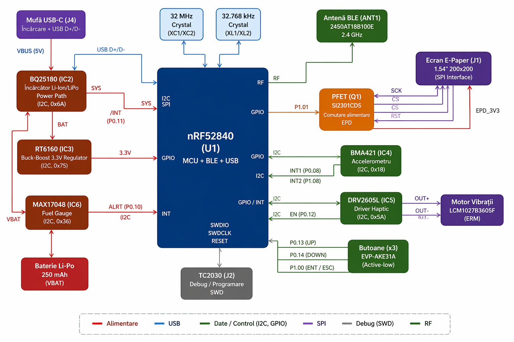

# InkTime Watch

A low-power e-paper smartwatch built around the **nRF52840**, designed for long battery life, sunlight readability, BLE connectivity, and essential wearable functionality such as notifications, timekeeping, basic motion tracking, and haptic feedback.

The platform integrates a **1.54" e-paper display**, **BLE 5.0**, **USB-C charging**, **battery fuel gauging**, **accelerometer-based activity tracking**, and a **haptic feedback driver**, all inside a compact custom enclosure.



---

## Overview

InkTime Watch is a custom smartwatch hardware platform optimized for:
- **Ultra-low power consumption**
- **Always-readable e-paper display**
- **Bluetooth Low Energy communication**
- **Battery-powered operation**
- **Compact wearable form factor**

The system is centered on the **Nordic nRF52840**, which handles BLE communication, USB connectivity, GPIO control, and communication with all peripherals over SPI and I2C.

---

## Block Diagram

```text
                              ┌─────────────────────────────────────────────┐
                              │                 nRF52840                   │
                              │          MCU + BLE + USB Interface         │
                              │                                             │
                              │ SPI ───────────────► E-Paper Display        │
                              │ I2C ───────────────► BMA421                 │
                              │ I2C ───────────────► MAX17048               │
                              │ I2C ───────────────► BQ25180                │
                              │ I2C ───────────────► DRV2605L               │
                              │ GPIO ──────────────► Buttons                │
                              │ GPIO ──────────────► PFET Display Switch    │
                              │ SWDIO / SWDCLK ────► Tag-Connect SWD        │
                              │ D+ / D- ───────────► USB Type-C             │
                              │ ANT ───────────────► 2.4 GHz Antenna        │
                              │ XC1 / XC2 ─────────► 32 MHz Crystal         │
                              │ XL1 / XL2 ─────────► 32.768 kHz Crystal     │
                              └─────────────────────────────────────────────┘
                                              │
                                              ▼
                              ┌─────────────────────────────────────────────┐
                              │                 Power Tree                 │
                              │ USB 5V → BQ25180 → SYS → RT6160 → 3.3V    │
                              │ LiPo → BQ25180 BAT                         │
                              │ LiPo → MAX17048                            │
                              │ 3.3V → PFET → Switched EPD Rail           │
                              └─────────────────────────────────────────────┘


Bill of Materials (BOM)
Active & Critical Components
+----------------------+-------------------------------------------+-----------+------------+----------------------+
| Component            | Description                               | Package   | Part       | Datasheet            |
+----------------------+-------------------------------------------+-----------+------------+----------------------+
| nRF52840             | BLE 5.0 Cortex-M4F MCU                   | AQFN-73   | C190794    | Nordic nRF52840      |
| BQ25180YBGR          | 1A LiPo Charger (I2C)                    | DSBGA-8   | BQ25180YBGR| TI BQ25180           |
| MAX17048G+T10        | Fuel Gauge                              | TDFN-8    | C2682616   | Maxim MAX17048       |
| RT6160AWSC           | 3.3V Buck-Boost                         | WLCSP-15  | C7065276   | Richtek RT6160A      |
| BMA421               | IMU / Step Counter                      | LGA-12    | C5242966   | Bosch BMA421         |
| DRV2605YZFR          | Haptic Driver                           | DSBGA-9   | C527464    | TI DRV2605           |
| 2450AT18B100E        | 2.4GHz Antenna                          | 1206      | C2917717   | Johanson             |
| USBLC6-2SC6Y         | USB ESD Protection                      | SOT-23-6  | C2969755   | ST USBLC6-2          |
| KH-TYPE-C-16P        | USB-C Connector                         | SMD       | C168704    | Generic              |
| 503480-2400          | 24-pin FPC (EPD)                        | SMD       | —          | Molex                |
| DMG2305UX            | P-MOSFET (EPD power)                    | SOT-23    | C2940629   | Diodes Inc           |
| MBR0530              | Schottky Diode                          | SOD-123   | C77336     | Onsemi               |
| TC2030-IDC           | SWD Tag-Connect                         | PCB       | —          | Tag-Connect          |
+----------------------+-------------------------------------------+-----------+------------+----------------------+

Passive Components
+-----------------------------+-----------+--------+-----+-----------------------------+
| Component                   | Value     | Package| Qty | Function                    |
+-----------------------------+-----------+--------+-----+-----------------------------+
| Decoupling capacitors       | 100nF     | 0201   | 5   | MCU + peripherals           |
| Crystal load capacitors     | 12pF      | 0201   | 4   | Crystals                    |
| Bulk capacitors             | 4.7uF     | 0402   | 4   | Power buffering             |
| USB capacitor               | 4.7uF     | 0402   | 1   | USB stability               |
| Power capacitors            | 22uF      | 0402   | 2   | RT6160 input               |
| Charger capacitors          | 1uF       | 0402   | 3   | BQ25180 support            |
| E-paper capacitors          | 1uF / 50V | 0402   | 9   | Display driver             |
| MCU DC/DC inductor          | 10uH      | 0402   | 1   | nRF52840 regulator         |
| Buck-boost inductor         | 0.47uH    | 2012   | 1   | RT6160                     |
| I2C pull-up resistors       | 10k       | 0201   | 2   | SDA / SCL                  |
| USB-C CC resistors          | 5.1k      | 0201   | 2   | USB configuration          |
| Crystal                     | 32 MHz    | 2016   | 1   | MCU / RF clock             |
| Crystal                     | 32.768 kHz| 3215   | 1   | RTC                        |
+-----------------------------+-----------+--------+-----+-----------------------------+
                              Main Features
nRF52840 BLE-enabled microcontroller
1.54" e-paper display with SPI interface
BQ25180 charger and power path management
RT6160 buck-boost regulator for stable 3.3V rail
MAX17048 fuel gauge for battery monitoring
BMA421 accelerometer for motion / step tracking
DRV2605L haptic driver for vibration feedback
USB Type-C charging and USB data interface
Tag-Connect SWD footprint for debugging/programming
Compact custom PCB + enclosure integration
Bill of Materials (BOM)
Active Components
Component	Part Number	Package	Function
MCU	nRF52840-QIAA-R	aQFN73	Main microcontroller + BLE + USB
Charger / Power Path	BQ25180YBGR	DSBGA-8	Li-Ion/LiPo charger with power-path
Buck-Boost Regulator	RT6160AWSC	WLCSP-15	3.3V system regulator
Fuel Gauge	MAX17048G+T10	DFN-8	Battery state-of-charge monitor
Accelerometer	BMA421	LGA-12	Motion / step detection
Haptic Driver	DRV2605LDGSR	VSSOP-10	ERM vibration motor driver
PFET	SI2301CDS	SOT-23	E-paper rail power switching
USB ESD Protection	USBLC6-2SC6Y	SOT-23-6	USB data line protection
Connectors & Electromechanical
Component	Part Number	Package	Function
Display Connector	Molex 503480-2400	24-pin FPC	E-paper display interface
USB Connector	KH-TYPE-C-16P	USB-C SMD	Charging + USB data
Buttons (x3)	EVP-AKE31A	SMD tactile	User input
SWD Debug Header	TC2030-IDC	Tag-Connect	Programming / debug
Antenna	2450AT18B100E	SMD	2.4 GHz BLE antenna
Vibration Motor	LCM1027B3605F	Wire leads	Haptic feedback
Important Passive Components
Component Type	Value	Package	Qty	Function
Decoupling capacitors	100nF	0201	multiple	Local supply decoupling
Crystal load capacitors	12pF	0201	4	Crystal load network
Bulk capacitors	4.7uF	0402	multiple	Local bulk decoupling
Charger capacitors	1uF / 10uF	0402	multiple	Charger input/output support
E-paper capacitors	1uF / 50V	0402	multiple	Display driver support
USB CC resistors	5.1k	0201	2	USB-C configuration
I2C pull-ups	10k	0201	2	SDA / SCL pull-up
DC/DC inductor	0.47uH	2012	1	RT6160 power stage
MCU DC/DC inductor	10uH	0402	1	nRF52840 REG1 support
Hardware Architecture
1. Microcontroller - nRF52840

The nRF52840 is the main controller of the system and provides:

Bluetooth Low Energy connectivity
Native USB 2.0
GPIO control for buttons, power gating, interrupts, and debug
SPI for the e-paper display
I2C for sensors and power ICs

The MCU uses:

32 MHz crystal for high-frequency operation and BLE radio
32.768 kHz crystal for RTC timekeeping
dedicated decoupling and internal regulator support capacitors
2. Power System

The board uses a battery-powered architecture with USB charging and a regulated 3.3V rail.

Power path:
USB 5V enters through the USB-C connector
BQ25180 manages charging and power-path behavior
RT6160 generates the main 3.3V rail
MAX17048 monitors battery voltage and charge state
a PFET is used to switch the e-paper display supply rail
Main rails:
VBUS – USB input
VBAT – battery rail
SYS – charger output / system rail
3V3 – regulated main logic rail
VEPD – switched rail for e-paper circuitry
3. E-Paper Display Subsystem

The e-paper display is connected through a 24-pin FPC connector and controlled via SPI.

Main signals:

SCK
MOSI
CS
DC
RST
BUSY

A dedicated PFET is used to switch display power in order to reduce leakage and improve overall battery life.

4. Accelerometer - BMA421

The BMA421 accelerometer is connected via I2C and provides:

step counting
motion detection
wake-up interrupt capability

It is used as the low-power motion sensing block of the watch.

5. Fuel Gauge - MAX17048

The MAX17048 provides battery monitoring and state-of-charge estimation.
It connects directly to the battery rail and communicates with the MCU over I2C.

6. Haptic Feedback - DRV2605L + ERM Motor

The DRV2605L haptic driver controls an ERM vibration motor and is connected via I2C.

It is used for:

alert vibration
notification feedback
user interaction feedback
7. USB Type-C Interface

The USB-C connector provides:

charging input
USB 2.0 D+ / D-
VBUS detection
ESD protection through USBLC6-2SC6Y
proper USB-C device configuration using 5.1k CC resistors
8. SWD Debug Interface

A Tag-Connect TC2030-IDC footprint is used for:

programming
firmware upload
SWD debugging
board bring-up and recovery

This avoids using a permanently mounted debug header and saves space.

9. RF / Antenna Section

BLE communication is handled through a 2.4 GHz chip antenna and a matching network connected to the nRF52840 RF pin.

The antenna area requires:

dedicated keepout
clean ground strategy
short RF path
careful matching network placement


PCB Design
Layout Strategy

The PCB layout was designed with the following priorities:

keep RF section isolated
keep charger / regulator away from antenna
place buttons on the user-facing edge
keep USB-C aligned with enclosure
route power first, then USB, RF, and remaining signals
keep decoupling capacitors as close as possible to IC power pins
Design Considerations
compact placement around the nRF52840
dedicated matching area for the antenna
accessible SWD debug interface
grouped test points for power and debug
display connector positioned to match enclosure integration

License

This project is intended for educational use unless otherwise specified.
